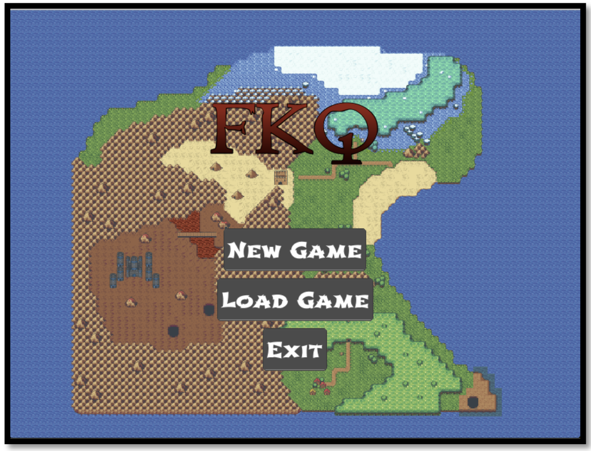
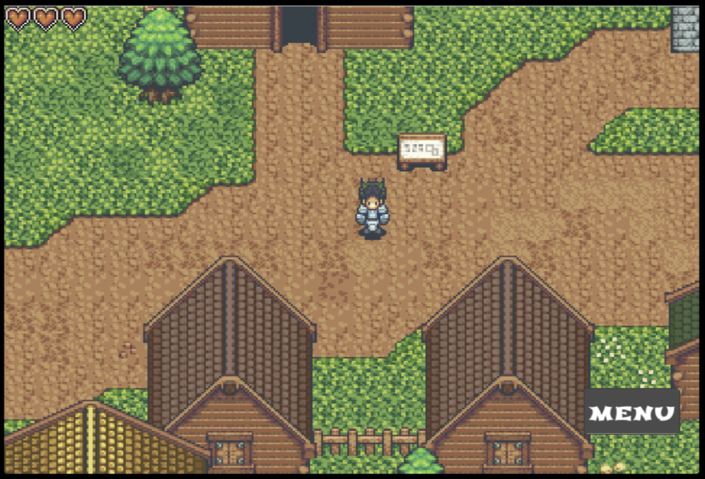
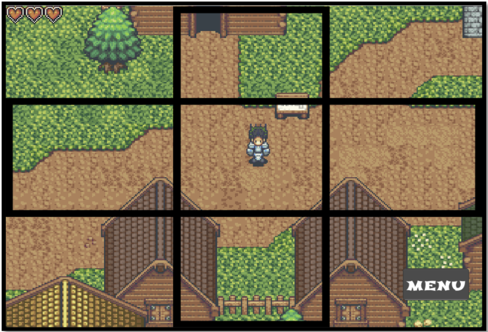
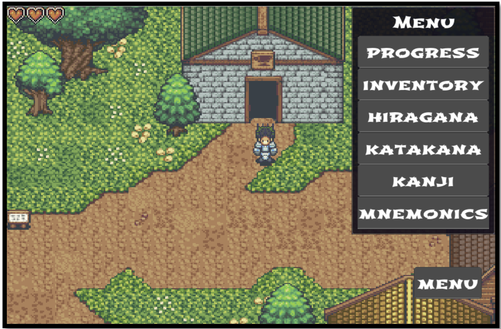
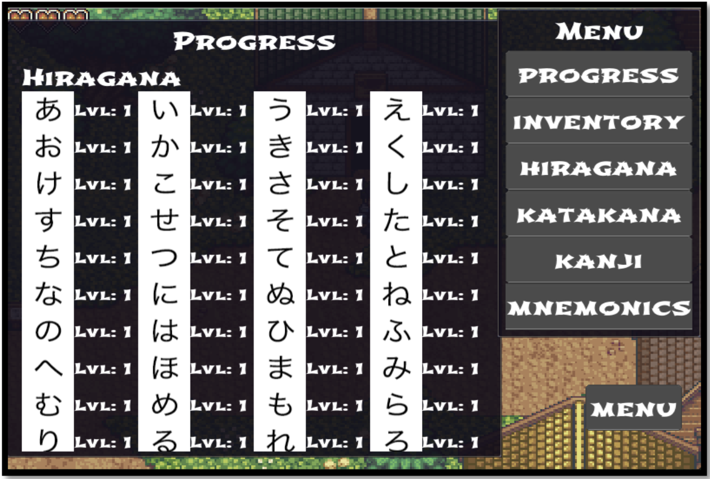
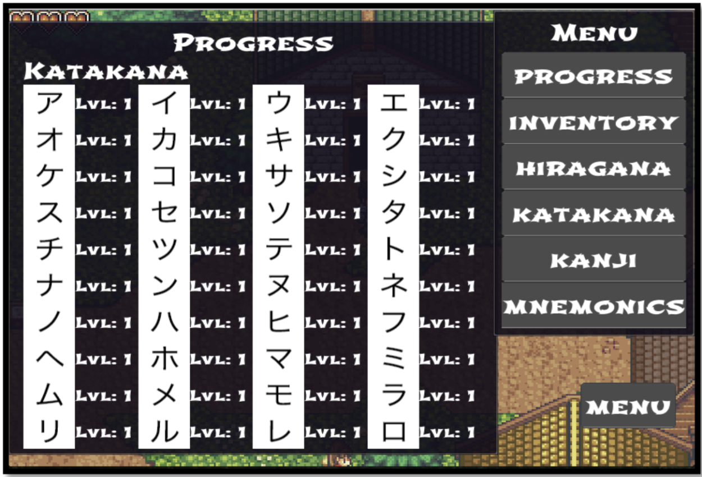
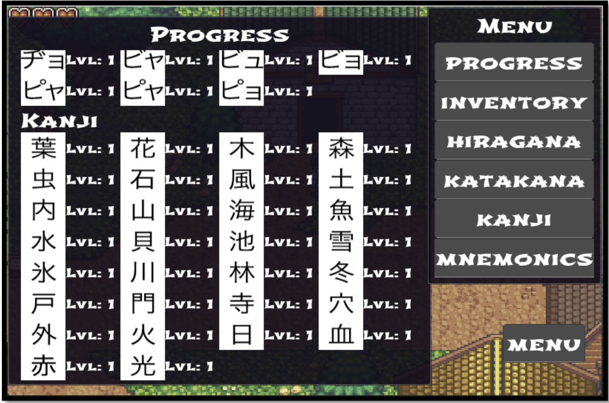
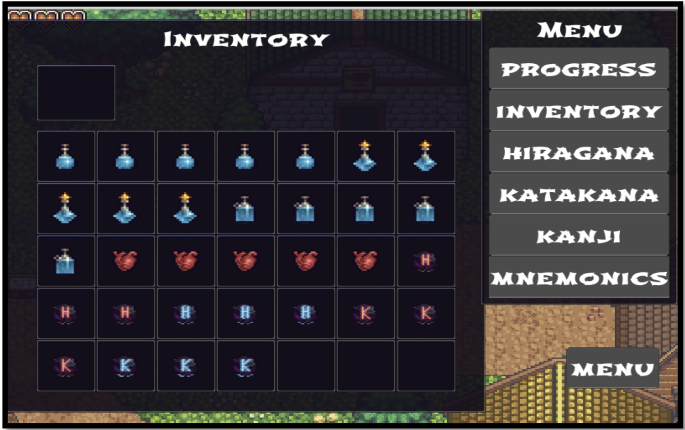
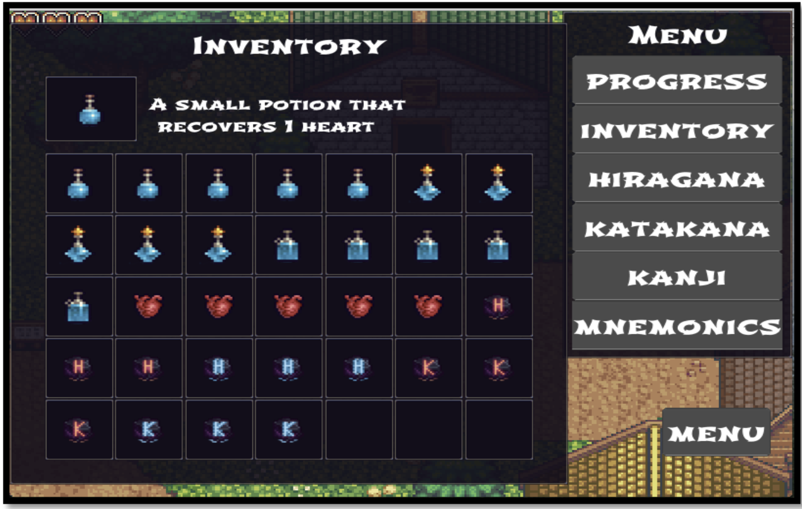

# Final Kanji Quest

Final Kanji Quest (FKQ) is a game that aims to teach the Japanese writing system by transforming traditional learning strategies, such as the spaced repetition algorithm (SRS), into a role-playing adventure game. 

## Game Start 

| Onboarding Screen | Starting Location | 
|---------------------------|-----------------------------------------------|
|  |  |                                          

## Game Controls 

Users are able to move the player character by tapping on one of the corners of the screen e.g. top-left box will move the character diagonally up-left. Desktop users are also able to do so using the arrow keys. The middle box is reserved for selecting things when the player character is facing them such as non-player characters (NPC) or treasure boxes.

<table>
  <tr>
    <td></td>
    <td></td>
  </tr>
</table>

## Menu Buttons

Tapping on the progress menu item reveals each study item's SRS level. The hignest SRS level for hiragna and katakana is 3, but for kanji it is 5 as they require more time to learn.  

<table>
  <tr>
    <td></td>
    <td></td>
  </tr>
    <td></td>
</table>

Tapping on the inventory menu itme will reveal the player character's inventory. Tapping on an item will display it in the top slot with its description. To consume or use a selected item users have to tap the item while on the top slot.

<table>
  <tr>
    <td></td>
    <td></td>
  </tr>
</table>

The available items and their effects are as follows:

| Item Description | Item Effect | 
|---------------------------|-----------------------------------------------|
| Medium potion | Recovers 3 hearts |   
| Large potion | Recovers 5 hearts |   
| Extra heart | Increases max number of available hearts by one |   
| + Hiragana mystery stone | Stops encounters with hiragana characters |   
| - Hiragana mystery stone | Resets encounters with hiragana characters |   
| + Katakana mystery stone | Stops encounters with katakana characters |   
| - Katakana mystery stone | Resets encounters with katakana characters |   

 
