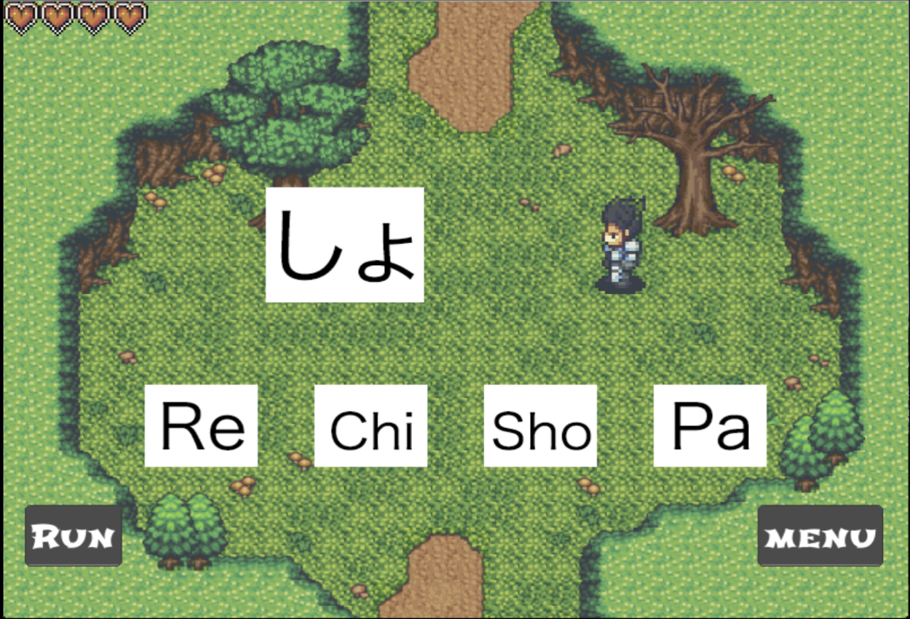
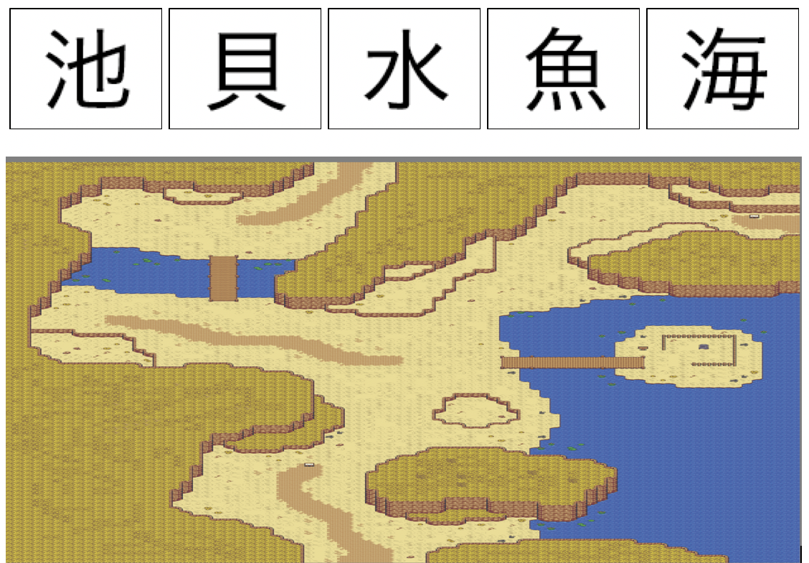

# Final Kanji Quest

Final Kanji Quest (FKQ) is a game that aims to teach the Japanese writing system by transforming traditional learning strategies, such as the spaced repetition algorithm (SRS), into a role-playing adventure game. 

## Game Start 

| Onboarding Screen | Starting Location | 
|---------------------------|-----------------------------------------------|
|  |  |                                          

## Game Controls 

Users are able to move the player character by tapping on one of the corners of the screen, for example, the top-left box will move the character diagonally up-left. Desktop users are also able to do so using the arrow keys. The middle box is reserved for selecting things when the player character is facing them, such as non-player characters (NPC) or treasure boxes.

<table>
  <tr>
    <td></td>
    <td></td>
  </tr>
</table>

## Menu Buttons

Tapping on the progress menu item reveals each study item's SRS level. The highest SRS level for hiragana and katakana is 3, but for kanji, it is five as they require more time to learn.  

<table>
  <tr>
    <td></td>
    <td></td>
  </tr>
    <td></td>
</table>

Tapping on the inventory menu item will reveal the player character's inventory. Tapping on an item will display it in the top slot with its description. To consume or use a selected item, users have to tap the item while on the top slot.

<table>
  <tr>
    <td></td>
    <td></td>
  </tr>
</table>

The available items and their effects are as follows:

| Item Description | Item Effect | 
|---------------------------|-----------------------------------------------|
| Medium potion | Recovers 3 hearts |   
| Large potion | Recovers 5 hearts |   
| Extra heart | Increases max number of available hearts by one |   
| + Hiragana mystery stone | Stops encounters with hiragana characters |   
| - Hiragana mystery stone | Resets encounters with hiragana characters |   
| + Katakana mystery stone | Stops encounters with katakana characters |   
| - Katakana mystery stone | Resets encounters with katakana characters |   

## Character Menu Buttons 

Tapping on any of the remaining menu items will open a window showing the corresponding characters with their equivalent Latin character and mnemonics to help with remembering them.      
 
<table>
  <tr>
    <td></td>
    <td></td>
  </tr>
    <tr>
    <td></td>
    <td></td>
  </tr>
</table>

## Game Mechanics 

While exploring the world, the player will encounter the Japanese characters to be learned. To resolve an encounter, the users have to choose the Latin or kana characters equivalent to the encountered character. Each character's encounter rate is determined by its spaced repetition algorithm (SRS) level. Each time a character encounter is resolved successfully, its SRS level goes by one. Answering incorrectly reduced the amount of available hearts. Once all hearts are used, a Game Over screen is displayed. 

<table>
  <tr>
    <td></td>
    <td></td>
  </tr>
</table>

## Kanji Appropriate Maps 

Once a user has learned all hiragana and katakana characters or opted out of learning them, kanji characters will start appearing. The kanji characters appear in areas that suit their meaning to help with memorization. 

<table>
  <tr>
    <td></td>
    <td></td>
  </tr>
  <tr>
    <td></td>
    <td></td>
  </tr>
    <tr>
    <td></td>
    <td></td>
  </tr>
  <tr>
    <tr>
    <td></td>
    <td></td>
  </tr>
</table>
